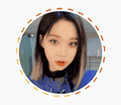

## 인스타그램의 profile animation

profile 사진이 story가 있으면 신기한 animation
이미지를 확인해보니 canvas를 사용해서 animation을 구현했다.  
그래서 이미지에 canvas를 추가해본다.  
useRef로 canvas를 가져오고

```javascript
function StoryCanvas() {
  const canvasRef = useRef < HTMLCanvasElement > null;

  return <canvas ref={canvasRef} width={'168'} height={'168'} />;
}
```

테두리를 그려주는 drawLine()을 만들어주고,  
useEffect로 호출해주자.

```javascript
const drawLine = () => {
  if (!canvasRef.current) {
    return;
  }
  const canvas: HTMLCanvasElement = canvasRef.current;
  const context = canvas.getContext('2d');

  if (context) {
    const gradient = context.createLinearGradient(168, 0, 0, 168);
    gradient.addColorStop(0, '#FF0000');
    gradient.addColorStop(1, '#FFFF00');
    context.strokeStyle = gradient;
    context.lineJoin = 'round';

    context.beginPath();
    context.arc(84, 84, 82, 0, Math.PI * 2, false);
    context.lineWidth = 2;
    context.closePath();

    context.stroke();
  }
};

useEffect(() => {
  if (!canvasRef.current) {
    return;
  }
  const canvas: HTMLCanvasElement = canvasRef.current;
  const context: any = canvas.getContext('2d');

  drawLine();
}, []);
```

이렇게 하면 아래처럼 사진에 테두리가 생긴다.


하지만 확대해보면 선이 깨지는 것을 볼 수 있다.  
프로필 이미지 크기에 맞춰서 canvas를 만들었기 때문에 확대하면 해상도가 깨진다.  
canvas 사이즈를 키우고 window.devicePixelRatio를 이용해서 사이즈에 맞게 canvas를 조정해주자.

```javascript
const drawLine = () => {
  if (!canvasRef.current) {
    return;
  }
  const canvas: HTMLCanvasElement = canvasRef.current;
  const context = canvas.getContext('2d');

  if (context) {
    const gradient = context.createLinearGradient(455, 0, 0, 455);
    gradient.addColorStop(0, '#FF0000');
    gradient.addColorStop(1, '#FFFF00');
    context.strokeStyle = gradient;
    context.lineJoin = 'round';

    context.beginPath();
    context.arc(222, 222, 216, 0, Math.PI * 2, false);
    context.lineWidth = 6;
    context.closePath();

    context.stroke();
  }
};

useEffect(() => {
  if (!canvasRef.current) {
    return;
  }
  const canvas: HTMLCanvasElement = canvasRef.current;
  const context: any = canvas.getContext('2d');
  const dpr = window.devicePixelRatio;

  canvas.width = 455 * dpr;
  canvas.height = 455 * dpr;

  // CSS에서 설정한 크기와 맞춰주기 위한 scale 조정
  context.scale(dpr, dpr);
  drawLine();
}, []);

return <Canvas ref={canvasRef} width={'455'} height={'455'} />;
```

픽셀이 깨지지 않고 잘 나오는 것을 볼 수 있다.


간단한 animation을 추가해보자.

```javascript
let arcAngle: number = 0;

const drawLine = () => {
  ...

  if (context) {
    const gradient = context.createLinearGradient(455, 0, 0, 455);
    gradient.addColorStop(0, '#FF0000');
    gradient.addColorStop(1, '#FFFF00');

    context.beginPath();
    context.clearRect(0, 0, 455, 455);
    context.fillStyle = '#FAFAFAFD';
    context.closePath();

    for (let i = 0; i < 50; i += 2) {
      context.beginPath();
      context.arc(222, 222, 216, Math.PI * 2 * (arcAngle + 0.02 * i), Math.PI * 2 * (arcAngle + 0.02 * (i + 1)), false);
      context.lineWidth = 6;
      context.strokeStyle = gradient;
      context.stroke();
      context.closePath();
    }
  }
};

useEffect(() => {
  ...

  animation();

  // eslint-disable-next-line react-hooks/exhaustive-deps
}, []);

const animation = () => {
  if (!canvasRef.current) {
    return;
  }
  arcAngle += 0.004;
  drawLine();
  requestAnimationFrame(animation);
}
```



이제 drawLine 함수의 for 문 안을 수정해서 instastory profile을 만들어보자.

(arcAngle + 0.0005 _ 35 _ i)로 간격을 조정하고,
5 \* (i / 4 + 1)을 더해서 등차수열로 크기가 조금씩 더 커지게 해주자.

```javascript
context.arc(
  222,
  222,
  216,
  Math.PI * 2 * (arcAngle + 0.0005 * 35 * i),
  Math.PI * 2 * (arcAngle + 0.0005 * (35 * i + 5 * (i / 4 + 1))),
  false,
);
```

시간이 지날수록 테두리 한 칸의 사이즈를 길어지게 하기 위해 arcLength를 추가해주자.

```javascript
for (let i = 0; i < 44; i += 2) {
  context.beginPath();
  context.arc(
    222,
    222,
    216,
    Math.PI * 2 * (arcAngle + 0.0005 * 35 * i),
    Math.PI *
      2 *
      (arcAngle + 0.0005 * (35 * i + (5 + arcLength) * (i / 4 + 1))),
    false,
  );
  context.lineWidth = 6;
  context.strokeStyle = gradient;
  context.stroke();
  context.closePath();
}
const animation = () => {
  if (!canvasRef.current) {
    return;
  }
  arcAngle += 0.008;
  arcLength = arcLength + 0.8;
  drawLine();
  requestAnimationFrame(animation);
};
```

마지막으로 arcLength에 delay를 주고,  
requestAnimationFrame()가 영원히 지속되지 않게 제한을 주자.

```javascript
const animation = () => {
  if (!canvasRef.current) {
    return;
  }
  arcAngle += 0.008;
  if (arcAngle > 0.3) {
    arcLength = arcLength + 0.8;
  }
  drawLine();
  if (arcAngle < 1) {
    requestAnimationFrame(animation);
  }
};
```

완성! 깔끔하게 잘 나오는 것을 볼 수 있다.


